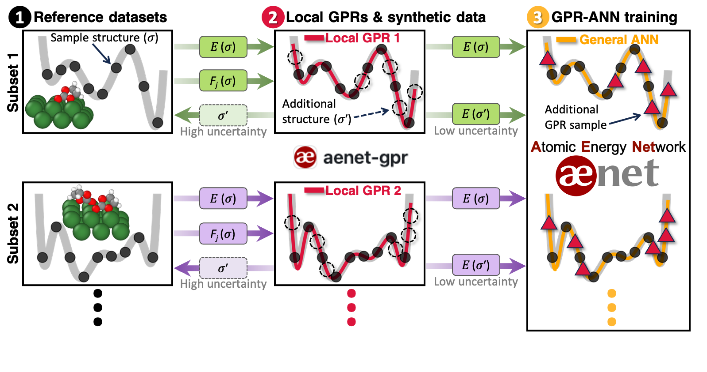
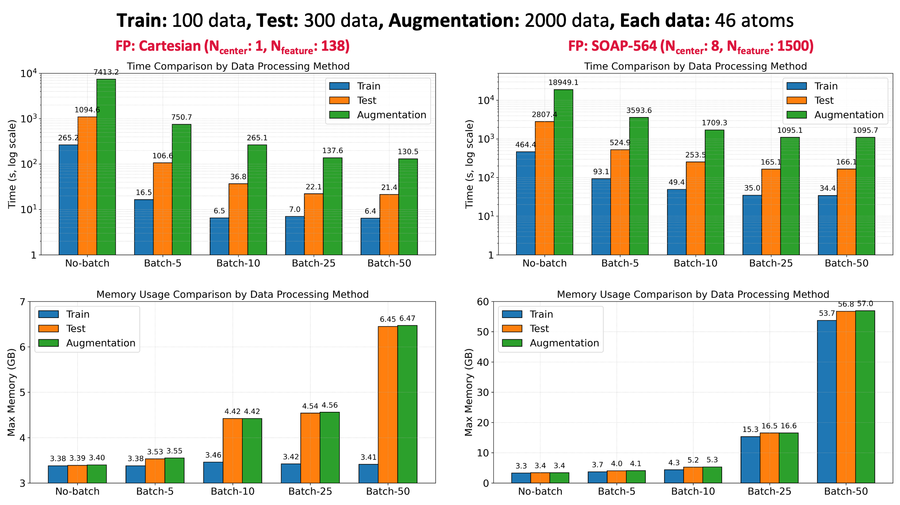

# ænet-gpr
**Efficient Data Augmentation for ANN Potential Training Using GPR Surrogate Models**

`aenet-gpr` is a Python package that enables scalable and cost-efficient training of artificial neural network (ANN) potentials by leveraging Gaussian Process Regression (GPR) as a surrogate model.  
It automates data augmentation to:

- Reduce the number of expensive DFT calculations  
- Significantly lower ANN training overhead critical for complex and heterogeneous interface systems  
- Maintain high accuracy comparable to the demanding direct force training

📄 Reference:  
[In Won Yeu, Alexander Urban, Nongnuch Artrith et al., “Scalable Training of Neural Network Potentials for Complex Interfaces Through Data Augmentation”, arXiv:2412.05773](https://doi.org/10.48550/arXiv.2412.05773)

📬 Contact:  
- In Won Yeu (iy2185@columbia.edu)  
- Nongnuch Artrith (n.artrith@uu.nl)

---

## 🔁 Workflow Overview

<p align="center">

</p>

1. **Data Grouping**  
   - Split the initial DFT database into homogeneous subsets (same composition and number of atoms)

2. **Train**  
   - Construct local GPR models using structure, energy, and atomic force data

3. **Test**  
   - Predict and evaluate target properties with the trained GPR models

4. **Augment**  
   - Perturb reference structures and generate new data  
   - Tag with GPR-predicted energies to expand the training dataset

✅ Outputs are saved in [XCrysDen Structure Format (XSF)](http://ann.atomistic.net/documentation/#structural-energy-reference-data), fully compatible with the [ænet package](https://github.com/atomisticnet/aenet-PyTorch) for indirect force training (**GPR-ANN**).

---

## 🔑 Key Features

- GPR-based prediction of energies and atomic forces with uncertainty estimates  
- Supports various descriptors including Cartesian and SOAP  
- Applicable to periodic and non-periodic systems  
- Batch-based kernel computation for speed and memory efficiency  
- Accepts multiple input formats (e.g., XSF, VASP OUTCAR, etc.)  
- Fully controlled through a single input file (`train.in`)

## 📦 Installation

**Requirements:**

- Python with PyTorch (to be installed separately)
- Other dependencies (`numpy`, `ASE`, `DScribe`) are automatically installed when installing `aenet-gpr`

### 1. Install PyTorch

Refer to [official guide](https://pytorch.org/get-started/locally) and install compatible versions depending on availablity of GPU and CUDA:

   - With CUDA (optional for GPU support):

     `$ pip install torch torchvision torchaudio --index-url https://download.pytorch.org/whl/cu118`

   - CPU-only:
 
     `$ pip install torch torchvision torchaudio --index-url https://download.pytorch.org/whl/cpu`


### 2. Install ænet-gpr
   
   - Installation using pip

     `$ pip install aenet-gpr`

## 📂 Input Files

### 1. Structure–Energy–Force Data

By default, input data is provided in `.xsf` format. Other formats (e.g., VASP OUTCAR) are also supported through [ASE](https://wiki.fysik.dtu.dk/ase/ase/io/io.html).

By default, the package uses the XSF format, but it also supports other output files—such as **VASP OUTCAR** (`File_format vasp-out` in `train.in` below)—that can be read via [ASE package](https://wiki.fysik.dtu.dk/ase/ase/io/io.html), as long as they contain the **structure-energy-atomic forces** information.

#### Example: aenet XSF format (non-periodic)
The first comment line should specify **total energy** of a structure. Each line following the keyword `ATOMS` contains **atomic symbol**, **three Cartesian coordinates**, and the three components of **atomic forces**. The length, energy, and force units are Å, eV, and eV/Å.
```
# total energy =  -0.0970905812353288 eV

ATOMS
H    -0.91666666666667    0.00000000000000    0.00000000000000    0.32660398877491    0.00000000000000    0.00000000000000
H    0.91666666666667    0.00000000000000    0.00000000000000    -0.32660398877491    0.00000000000000    0.00000000000000
```

#### Example: aenet XSF format (periodic)
```
# total energy = -16688.9969866290994105 eV

CRYSTAL
PRIMVEC
 10.31700000000000 0.00000000000000 0.00000000000000
 0.00000000000000 10.31700000000000 0.00000000000000
 0.00000000000000 0.00000000000000 32.00000000000000
PRIMCOORD
 46 1
Li     -0.02691046000000     0.02680527000000     10.32468480000000     -0.01367780493112     -0.01466501222916     0.08701630310868
Li     -0.04431013000000     3.46713645000000     10.25290534000000     0.06865473174602     -0.00786890285541     0.15426435842600
Li     0.02355300000000     6.82569825000000     10.31803445000000     0.00877419275000     0.03943267659765     0.14805797440506
...
```

## 2. aenet-gpr input file
A principal input file, named `train.in`, consists of lines in the format: 

`keyword 1` `argument 1`  
`keyword 2` `argument 2`  
...

In the example below, comments are provided to explain the meaning of keywords.

### Example of train.in
```
# File path
Train_file ./example/3_Li-EC/train_set/file_*.xsf
Test_file ./example/3_Li-EC/test_set/file_*.xsf

# Train model save (default: False)
Train_model_save False  # True-> train data and trained GPR model are saved in "data_dict.pt" and "calc_dict.pt"

# File format (default: xsf)
File_format xsf  # Other DFT output files, which can be read via ASE such as "vasp-out" "aims-output" "espresso-out", are also supported

# Uncertainty estimation (default: True)
Get_variance True  # False -> only energy and forces are evaluated without uncertainty estimate

# Descriptor (default: cartesian coordinates)
Descriptor cart  # cart or soap

# Kernel parameter (default: Squared exponential)
scale 0.4  # default: 0.4
weight 1.0  # default: 1.0

# Data process (default: batch, 25)
data_process batch  # batch (memory cost up, time cost down) or iterative (no-batch: memory down, time up)
batch_size 25

# Flags for xsf file writing (default: False)
Train_write False  # True -> xsf files for reference training set are written under "./train_xsf/" directory
Test_write False  # True -> xsf files for reference test set are written under "./test_xsf/" directory
Additional_write False  # True -> additional xsf files are written under "./additional_xsf/" directory; False -> Augmentation step is not executed

# Data augmentation parameter (default: 0.055, 25)
Disp_length 0.05
Num_copy 20  # [num_copy] multiples of reference training data are augmented
```

<a name="usage-example"></a>
# Usage example
For example, once the `train.in` file above is prepared along with 100 training data files, named `file_{0000..0099}.xsf`, in the directory `./example/3_Li-EC/train_set/` and 300 test data files, named `file_{0000..0299}.xsf` in the directory `./example/3_Li-EC/test_set/`, **aenet-gpr** is executed by the following command:

```
$ python [path of aenet_GPR]/aenet_gpr.py ./train.in > train.out
```

Then, the **Train–Test–Augmentation** steps will be carried out sequentially. The progress details can be monitored in the `train.out` file, and the final augmented data files will be saved in XSF format under `./additional_xsf/` directory.  

<a name="tutorial"></a>
# Tutorial
The `./example/` directory of this repository includes example input and output files.

For each example, Jupyter notebook demonstrating how **aenet-gpr** is executed can be found in `./tutorial/*.ipynb`. The notebooks can be run directly using Google Colaboratory and is also shared at the following links:

  - Python interpreter run for the data in `./example/1_H2/`: https://colab.research.google.com/github/atomisticnet/aenet-gpr/blob/main/tutorial/aenet_gpr_tutorial_python_1_H2.ipynb
  - Command run for the data in `./example/1_H2/`: https://colab.research.google.com/github/atomisticnet/aenet-gpr/blob/main/tutorial/aenet_gpr_tutorial_1_H2.ipynb
  - Command run for the data in `./example/2_EC-EC/`: https://colab.research.google.com/github/atomisticnet/aenet-gpr/blob/main/tutorial/aenet_gpr_tutorial_2_EC-EC.ipynb
  - Command run for the data in `./example/3_Li-EC/`: https://colab.research.google.com/github/atomisticnet/aenet-gpr/blob/main/tutorial/aenet_gpr_tutorial_3_Li-EC.ipynb


<a name="key-keyword"></a>
## Key `train.in` input keywords that affect performance
### 1. Accuracy: `Descriptor` and kernel parameter (`scale` and `weight`)
**aenet-gpr** uses the following `squared exponential (sqexp)` as default kernel function with `scale` and `weight` parameters:

<p align="center">

</p>

To achieve more accurate data augmentation, it is recommended to tune the `scale` and `weight` parameters for each specific system.

Perform a series of **Train–Test** runs using a small subset of training and test data, while varying the `scale` and `weight`. This process helps identify the optimal kernel parameters. Following figure shows energy prediction errors of the `./example/3_Li-EC/` example with different kernel parameters and descriptors:

<p align="center">

</p>

`train.in` input file of default arguments
```
Descriptor cart  
scale 0.4  
weight 1.0
```
are shown above. When using the **Cartesian descriptor** (gray circles), the error decreases as the `scale` parameter increases, and it converges at `scale = 3.0`. In contrast, when using the **periodic SOAP descriptor** (for details, see the [DScribe documentation](https://singroup.github.io/dscribe/latest/tutorials/descriptors/soap.html)), the error is reduced by approximately one order of magnitude compared to the default **Cartesian descriptor**.  

As demonstrated in the examples for the `./example/2_EC-EC/` non-periodic system (results available in the `example` directory) and the `./example/3_Li-EC/` periodic system, non-periodic systems can be well-represented using **non-periodic Cartesian descriptors**, while periodic systems are expected to yield better accuracy when using **SOAP descriptors** with periodic setting.  

For the example of **SOAP descriptor** here, eight uniformly distributed points in the Li slab Rectangular cuboid were used as `centers` argument for **SOAP**. The corresponding `train.in` input arguments are
```
Descriptor soap
soap_r_cut 5.0
soap_n_max 6
soap_l_max 4
soap_centers [[2.20113706670393, 2.328998192856251, 6.952547732109352], [2.20113706670393, 2.328998192856251, 11.895790642109352], [2.20113706670393, 6.760484232856251, 6.952547732109352], [2.20113706670393, 6.760484232856251, 11.895790642109352], [6.63924050670393, 2.328998192856251, 6.952547732109352], [6.63924050670393, 2.328998192856251, 11.895790642109352], [6.63924050670393, 6.760484232856251, 6.952547732109352], [6.63924050670393, 6.760484232856251, 11.895790642109352]]
soap_n_jobs 4  
  
scale 2.0  
weight 1.0
```

### 2. Cost: `data_process` and `batch_size`
The GPR model fitted to both energy and force data requires computing covariances between the fingerprint tensors of shape `[n_data, n_center, n_feature]` and the [fingerprint derivative](https://singroup.github.io/dscribe/latest/tutorials/derivatives.html) tensors of shape `[n_data, n_center, n_atom, 3, n_feature]`. This leads to high memory demands.  

On the other hand, computing kernels data-by-data (`data_process iterative`) involves `n_data × n_data` sequential kernel evaluations, minimizing the memory overhead but significantly increasing computational time.  

To address this, **aenet-gpr** supports batch processing (`data_process batch`) by grouping data process into a specific size (`batch_size 25`), which significantly reduces train and evaluation time while keeping memory usage efficient.

Below, we provide a benchmark comparing the required time and memory for each **Train–Test–Augmentation** step using different batch sizes on the `./example/3_Li-EC/` example.

<p align="center">

</p>
